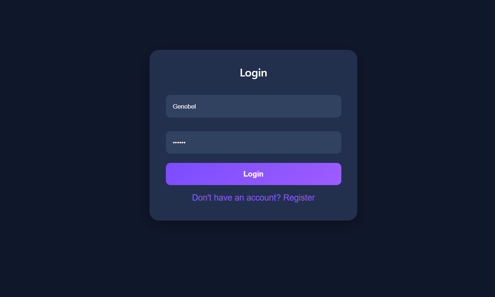
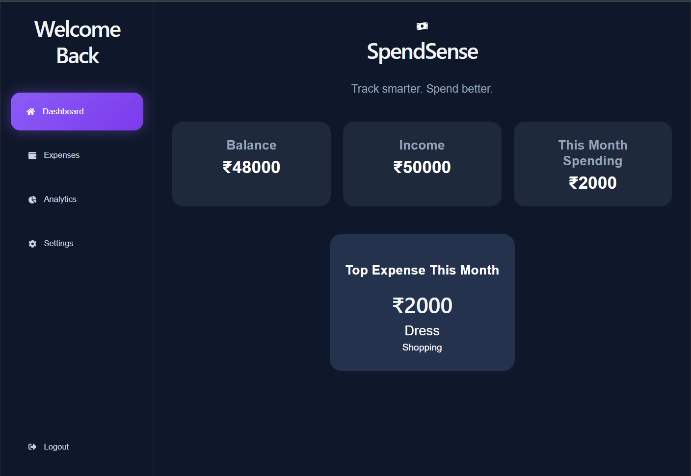
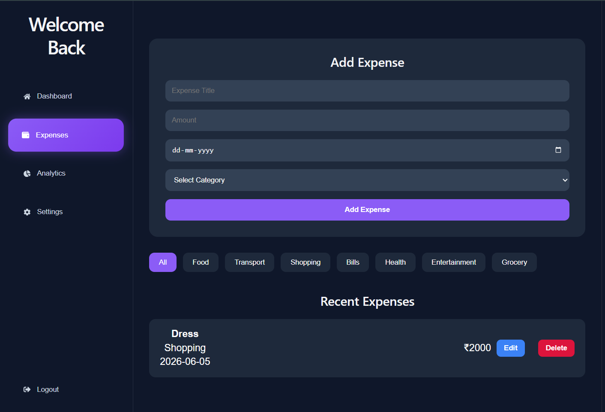
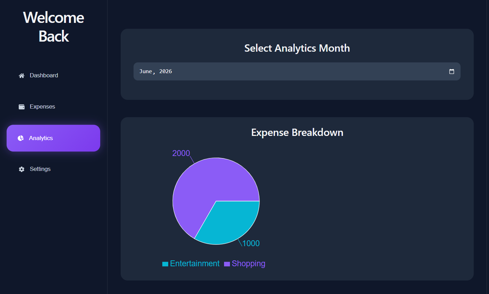
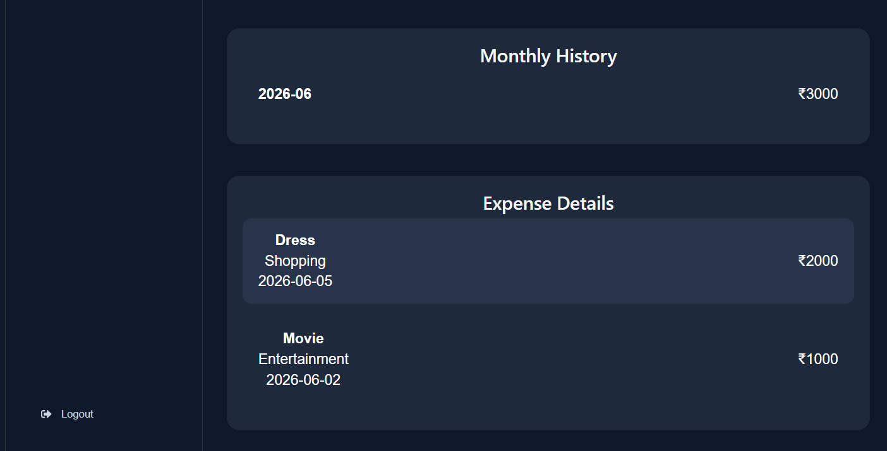
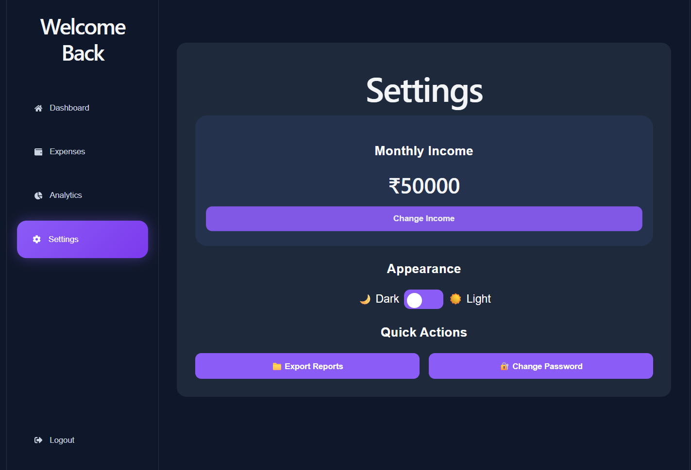

# 💰 SpendSense

A Personal Finance Management Application built using React, Flask, and SQLite.

## 🌐 Live Demo

https://spend-sense-peach.vercel.app

## ✨ Features

- User Registration & Login
- Password Validation
- Expense Tracking
- Monthly Expense Analytics
- Income Management
- CSV Report Export
- Dark / Light Theme Toggle
- Responsive Dashboard

## 🛠️ Tech Stack

### Frontend
- React
- Vite
- CSS
- Axios

### Backend
- Flask
- SQLite

### Deployment
- GitHub
- Vercel

## 📸 Screenshots

## 📸 Screenshots

### Login Page



### Dashboard



### Expenses



### Analytics






### Settings



## 🚀 Installation

### Frontend

```bash
cd frontend
npm install
npm run dev
```

### Backend

```bash
cd backend
python app.py
```

## 📂 Project Structure

```txt
SpendSense
│
├── frontend
│   ├── src
│   ├── public
│   └── package.json
│
├── backend
│   ├── app.py
│   ├── database.py
│   └── expenses.db
```

## 👨‍💻 Author

Genobel Johannah P

---


